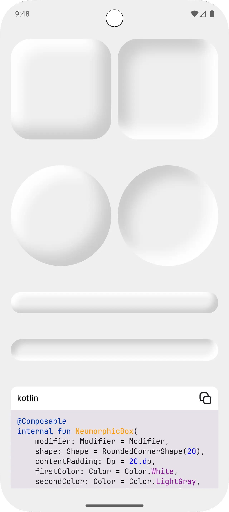

# Composable

**An open-source Android app showcasing Jetpack Compose UI components and interactions for learning and inspiration.**

https://github.com/user-attachments/assets/a940ce12-e9d1-4fd1-b6dd-c759088a3a0a

</img>
</img>

---

### Description

Composable is a beautifully simple Android showcase built with Jetpack Compose. The idea is to gather cool UI components, and interactions in one place so it can serve as both inspiration and a learning resource for the Android community. Ideal for developers looking to explore UI ideas, learn Compose best practices, or jumpstart their own projects.

---

### Getting Started

1. **Clone the repo**:

   ```bash
   git clone https://github.com/cinkhangin/composable.git
   cd composable
   ```

2. **Open in Android Studio**:
   Simply import the project, sync Gradle, and run the app on your device or emulator.

3. **Explore & Learn**:
   Browse the `app/src/main/java` directory to inspect Compose patterns in action.

---

### Why Use It?

* **Inspiration**: Discover engaging UI ideas and transitions
* **Learning Resource**: Study clean Compose implementations in Kotlin
* **Copy & Customize**: Easily reuse components in your own projects

---

### Contribute

Contributions are warmly welcome! Whether it’s a new component, improved UI, or better documentation-feel free to submit a pull request or open an issue.

---

### License

This project is licensed under the **MIT License**—see the [LICENSE](LICENSE) file for details.
