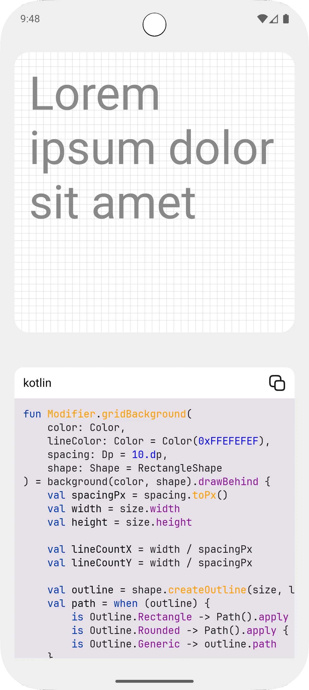

# Composable

**An open-source Android app showcasing Jetpack Compose UI components and interactions for learning and inspiration.**

</img>


https://github.com/user-attachments/assets/5c5affa1-5d70-4cc1-84ca-f3c10dcc1cd9

https://github.com/user-attachments/assets/24df34d1-fe36-479f-bf41-eb7fd524e740

https://github.com/user-attachments/assets/cce1dac1-6726-435e-b5e6-3f73c511569c

https://github.com/user-attachments/assets/ca1b1d4f-a4e6-451c-b4a2-916338214c79

https://github.com/user-attachments/assets/dd7fa015-5807-4c8a-be56-b061537bc978

https://github.com/user-attachments/assets/def2e67d-89d1-498d-9ce5-ca715f9c2f73

https://github.com/user-attachments/assets/2bfdb6a2-457c-4bb8-8208-c94c403723bc

https://github.com/user-attachments/assets/4b0d2eaa-b25e-46db-b98e-f835178f0e2f

https://github.com/user-attachments/assets/62abab0c-cdf3-4021-86d8-d7a21832c112

https://github.com/user-attachments/assets/de8af136-b6b3-4080-a671-fb4405475df5

https://github.com/user-attachments/assets/19ede330-d5f6-4737-896a-e020123a0560

---

### Description

Composable is a beautifully simple Android showcase built with Jetpack Compose. The idea is to gather cool UI components, and interactions in one place so it can serve as both inspiration and a learning resource for the Android community. Ideal for developers looking to explore UI ideas, learn Compose best practices, or jumpstart their own projects.

---

### Getting Started

1. **Clone the repo**:

   ```bash
   git clone https://github.com/cinkhangin/composable.git
   cd composable
   ```

2. **Open in Android Studio**:
   Simply import the project, sync Gradle, and run the app on your device or emulator.

3. **Explore & Learn**:
   Browse the `app/src/main/java` directory to inspect Compose patterns in action.

---

### Why Use It?

* **Inspiration**: Discover engaging UI ideas and transitions
* **Learning Resource**: Study clean Compose implementations in Kotlin
* **Copy & Customize**: Easily reuse components in your own projects

---

### Contribute

Contributions are warmly welcome! Whether it’s a new component, improved UI, or better documentation-feel free to submit a pull request or open an issue.

---

### License

This project is licensed under the **MIT License**—see the [LICENSE](LICENSE) file for details.
